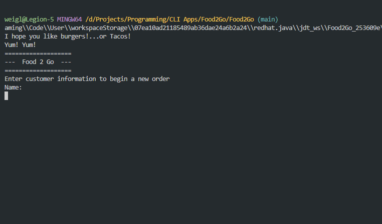

# Food2Go
A command-line application that allows a user to order a meal.

    

---
## What is it?
A program to demonstrate OOP concepts. User inputs meal choices into a CLI menu, and a reciept is printed with the meal items and total.

---
## Table of contents
- [Purpose](#purpose)
- [Method](#method)
- [Installation](#installation)
- [Navigation](#navigation)
- [Reflection](#reflection)
- [Links](#links)

---
## Purpose

---
## Method

---
## Installation

---
## Navigation
Run the program from 'main.py'. In the terminal:  
**Make a selection**
- [1] 
- [2]

---
## Reflection

---
## Links
